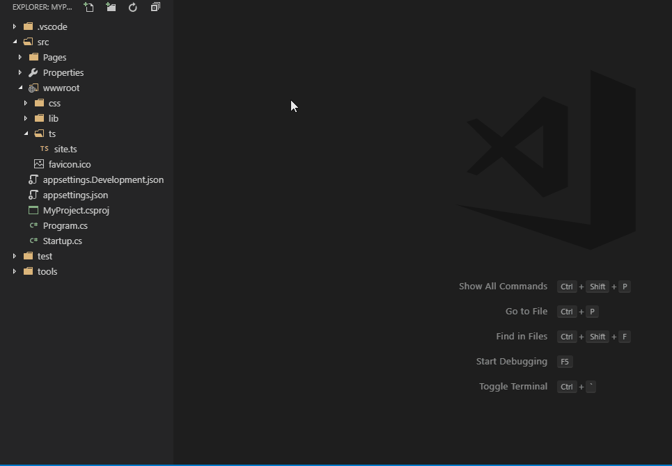

# Terminal Command Shortcuts

Run predefined terminal commands from explorer's context menu or Command Palette.

## See how it works



## Configuration
```json
    "terminalCommandShortcuts.commands": [
        {
            "command": "ng g c ",
            "name": "Generate Component"
        },
        {
            "command": "tsc {resource}",
            "auto": true
        },
        {
            "command": "dotnet run",
            "auto": true,
            "group": ".NET Core"
        },
        {
            "command": "dotnet add page -n ",
            "group": ".NET Core"
        },
        {
            "command": "dotnet watch run",
            "auto": true,
            "preserve": true,
            "group": ".NET Core"
        },
        {
            "command": "dotnet add package {clipboard}",
            "auto": true,
            "group": ".NET Core"
        }
    ]
```

| Property | Description                                                                                                   |
|----------|---------------------------------------------------------------------------------------------------------------|
| command  | The text to send to the terminal.                                                                             |
| auto     | Whether to add a new line to the text being sent, this is normally required to run a command in the terminal. |
| preserve | Don't dispose of terminal running this command.                                                               |
| name     | Name for the command. A human readable string which is rendered prominent.                                    |
| group    | Commands sharing the group name will be grouped together in the menu.                                         |

| Variable    | Description                                                                                                |
|-------------|------------------------------------------------------------------------------------------------------------|
| {resource}  | Name of current resource.                                                                                  |
| {clipboard} | Clipboard content.                                                                                         |